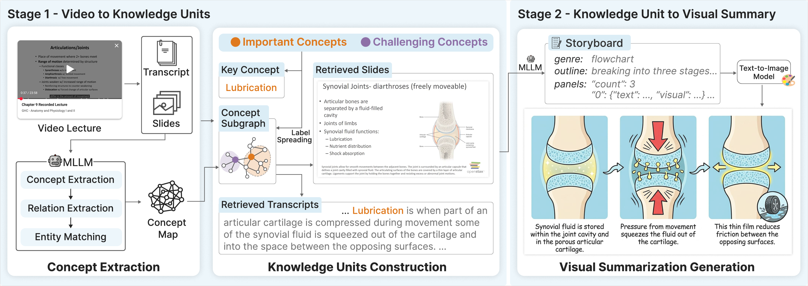
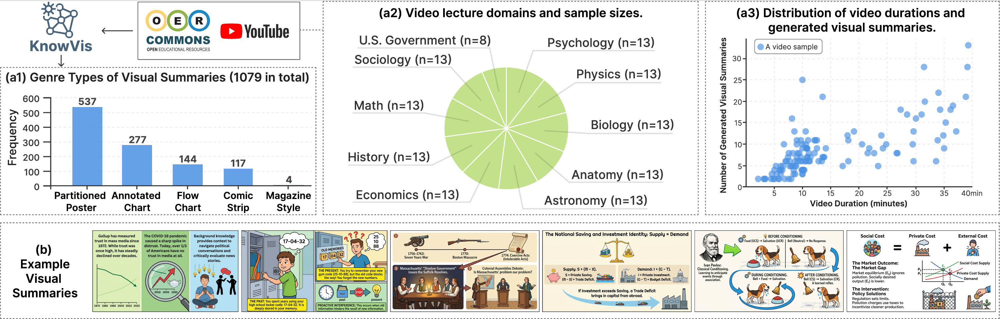

# KnowVis: Knowledge-Centric Visual Summarization for Video Lectures

> 📢 **Notice:** The full codebase and detailed usage instructions will be updated soon

**KnowVis** is a framework that transforms video lectures into pedagogically grounded visual narratives.

  

---

## Dataset

  

We collected 125 video lectures sourced from OER Commons and YouTube, spanning 10 distinct academic disciplines. From these multimodal inputs, we utilized KnowVis framwork to generate 1,079 pedagogically structured visual summaries. Each visual summary is paired with its source transcripts, slide frames, and concept subgraph. 
You can access and download the dataset directly from this Hugging Face [link](https://huggingface.co/datasets/yixu-cityu/KnowVis):

## How to run

Follow these steps to run KnowVis and generate pedagogically grounded visual summaries for key concepts in any video lecture.

### Input Video Format

### Environment Setup

### Run

